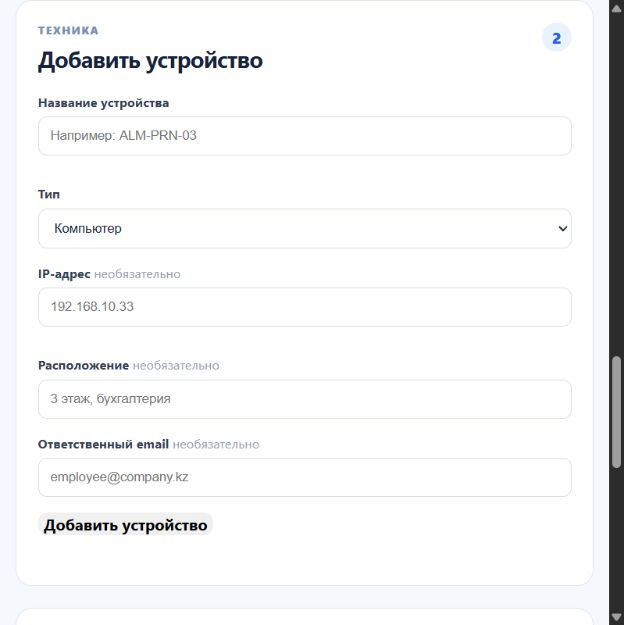

# IT HelpDesk & Infrastructure Monitor

Портфельный проект для позиций **IT Support / System Administrator / Junior Python Developer**.

Веб-приложение помогает сотрудникам сообщать о проблемах с техникой, а IT-команде — вести заявки и контролировать оборудование.


## Видео-демо

[Смотреть работу HelpDesk](docs/demo-helpdesk.mp4)

## Что реализовано

- создание и просмотр IT-заявок с приоритетами и статусами;
- учёт ПК, ноутбуков, принтеров и сетевых устройств;
- проверка доступности оборудования по IP-адресу;
- роли: сотрудник, разработчик, IT-специалист и системный владелец;
- изоляция обращений: сотрудник видит только свои заявки, IT-команда и администратор — всю очередь;
- отдельная кнопка закрытия заявки для системного администратора;
- регистрация, вход, профиль, имя и локальная загрузка аватара;
- управление статусом разработчика системным владельцем;
- проверка состояния API и PostgreSQL;
- Docker-окружение для локального запуска.



## Стек

- Python 3.12, FastAPI, SQLAlchemy;
- PostgreSQL;
- JWT-аутентификация и Argon2-хеширование паролей;
- Docker Compose;
- HTML, CSS, JavaScript;
- OpenAPI / Swagger: `http://localhost:8000/api-docs`.

## Запуск

1. Скопируйте `.env.example` в `.env` и задайте значения.
2. Установите Docker Desktop.
3. В папке проекта запустите:

   ```bash
   docker compose up --build
   ```

4. Откройте `http://localhost:8000`.

Для первого локального входа используется одноразовый системный администратор:

- email: `admin@helpdesk-demo.com`;
- пароль: `ChangeMe123!`.

После первого входа приложение попросит привязать личную почту и задать новый пароль. Стартовый доступ после этого перестаёт работать; дальнейший вход выполняется через кнопку «Войти».

## Что демонстрирует проект

- разработку REST API и работу с PostgreSQL;
- контейнеризацию через Docker Compose;
- реализацию ролевого доступа и авторизации;
- подход к ITSM: заявки, приоритеты, статусы и учёт оборудования;
- базовый инфраструктурный мониторинг через ping.
